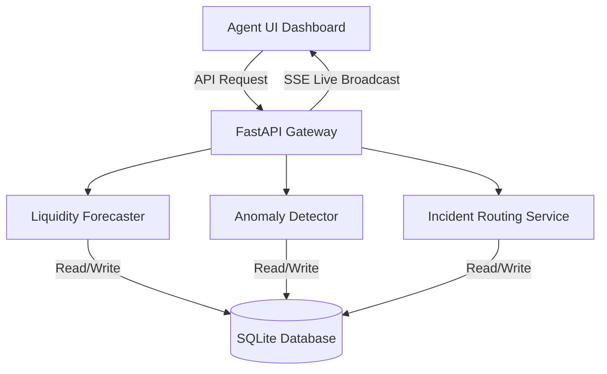

# Multi-Provider Super Agent — Technical Architecture
**Codex Community Hackathon — bKash presents SUST CSE Carnival 2026**

A decision-support prototype that helps a multi-provider "super agent" and operations teams manage liquidity forecasts, transaction anomalies, and case resolution without auto-blocking accounts or mixing wallet boundaries.

---

## 1. Project Structure
```
project/
├── backend/
│   ├── app/
│   │   ├── main.py            # FastAPI Entrypoint
│   │   ├── models/            # SQLAlchemy schemas & DB session
│   │   ├── routers/           # Agents, Cases, Simulate, Metrics APIs
│   │   ├── services/          # Liquidity, Anomaly, Coordination engines
│   │   └── ml/                # IsolationForest train script & model
│   └── requirements.txt
├── frontend/
│   ├── src/
│   │   ├── App.jsx            # Unified Agent + Ops View Dashboard
│   │   └── index.css          # Glassmorphism Dark Theme stylesheet
│   └── package.json
├── data/
│   └── synthetic/              # Raw CSV dumps for judges inspection
├── docs/
│   ├── api-documentation.md       # Full REST API Catalog & Swagger details
│   ├── architecture-diagram.md
│   ├── data-simulation-note.md
│   ├── deployment.md              # Render cloud deployment instructions
│   ├── final-presentation.md      # Pitch slide-deck & presentation script
│   └── responsible-design-note.md
├── render.yaml                    # Render Blueprint 1-click config
└── README.md
```

---

## 2. Technical Stack
- **Backend**: Python 3.13 / FastAPI (CORS-enabled gateway, async endpoints)
- **Database**: PostgreSQL (SQLAlchemy ORM for transaction velocity tracking)
- **ML Anomaly Detection**: scikit-learn `IsolationForest` (trained on a 7-day normal baseline, contamination=0.03)
- **Frontend**: React (Vite-scaffolded, structured view, styled with custom Vanilla CSS glassmorphism)

---

## 3. Quickstart Installation & Setup

### Prerequisites
- macOS with Homebrew installed
- Python 3.10+
- Node.js (v18+) & npm

### Step 1: Database Setup
Start local PostgreSQL service and create the database:
```bash
brew install postgresql@18
brew services start postgresql@18
/opt/homebrew/opt/postgresql@18/bin/psql -h localhost -d postgres -c "CREATE DATABASE super_agent;"
```

### Step 2: Backend Installation & Run
Create virtual environment, install requirements, and run FastAPI:
```bash
# Create venv
python3 -m venv venv
source venv/bin/activate

# Install dependencies
pip install -r backend/requirements.txt

# Run initial seed and train ML IsolationForest
python backend/app/simulator/generate_data.py

# Export CSV baseline reports
python backend/app/simulator/export_csv.py

# Run FastAPI Gateway (starts on http://localhost:8080)
uvicorn backend.app.main:app --host 0.0.0.0 --port 8080 --reload
```

Optional: copy `.env.example` to `.env` and add `GEMINI_API_KEY` or `OPENAI_API_KEY` if you want live AI-generated trilingual alert text. Without keys, the app uses deterministic local fallback text so the demo still works offline.

### Step 3: Frontend Installation & Run
Initialize node modules and start development server:
```bash
cd frontend
npm install
npm run dev -- --host 0.0.0.0 --port 3000
```
Open **[http://localhost:3000/](http://localhost:3000/)** in your browser. If port `3000` is busy, Vite will print the next available local URL, usually **[http://localhost:3001/](http://localhost:3001/)**.

---

## 4. Guide to Demo Scenarios

### Scenario A — Hidden Provider Shortage
- **Where to see**: Select **Agent A001** (Sajib Telecom) on the Agent Dashboard.
- **Narrative**: The agent's total value looks healthy (~$295,000$ BDT), but the bKash balance is depleted to $5,000$ BDT due to a high volume of cash-in transactions. 
- **System Output**: Shows a high-risk warning box with a bilingual alert (English + Bengali) warning the agent that bKash e-money will run out in ~6 minutes.

### Scenario B — Shared Cash Shortage with Anomaly
- **Where to see**: Select **Agent A002** (Mayer Doa Enterprise) on the Agent Dashboard.
- **Narrative**: High cash-out velocity drains physical cash to $8,000$ BDT. In addition, a wave of 5 identical $9,999$ BDT transactions occurs from the same account ID (`CUST_SUSPECT`) in 15 minutes.
- **System Output**: Displays a high-risk cash shortage alert *and* registers a high-confidence anomaly flag. In the **Ops Control Room**, a case is routed to the **Risk Analyst** role with a detailed evidence panel showing velocity, mean deviation, and counterparty repetition.

### Scenario C — Data Inconsistency & Delay
- **Where to see**: Select **Agent A003** (Riyad Variety Store) on the Agent Dashboard.
- **Narrative**: The Rocket balance feed has failed to update for 3 hours.
- **System Output**: The forecaster reduces the forecast confidence to $15\%$, rendering a warnings panel alerting the user that data is lagging and inconsistent.

### Scenario D — Coordinated Case Closure
- **Where to see**: Open **Ops Control Room** tab.
- **Narrative**: Select any case from the queue. Change acting user to the routed role (e.g. Risk Analyst or Provider Ops).
- **System Output**: Click **Acknowledge Case** (assigns owner). Click **Escalate** or **Resolve** and type notes. Verify that the changes appear instantly in the **Case Coordination Audit Trail** (timeline) showing actor roles and timestamps.

### Scenario E — Context-Aware Responsible Support Chatbot
- **Where to see**: Open the **Support Chatbot** window on the Agent Dashboard.
- **Narrative**: Interact with the chatbot as the active agent.
  - Type a casual query (e.g., *"Hello there!"*). The chatbot responds helper-oriented and politely, but does **not** clutter the database by creating a support ticket.
  - Type an operational request (e.g., *"My Rocket balance has lagged and is not updating"*). The chatbot automatically queries the agent's real-time system context (balances, forecasts, anomalies). It determines that human operations assistance is needed, routes a ticket to `provider_ops` with detailed scenario context and recommended troubleshooting instructions, and returns a success confirmation.
- **System Output**: The chatbot reply adheres to strict guardrails, refusing to make final operational declarations or decisions (e.g., it will state that a ticket is routed for human action rather than guaranteeing immediate resolution).

---

## 5. System Analytics & Validation
Click the **Validation Metrics** button at the top header of the UI to display the live metrics drawer:
1. **Anomaly Precision/Recall**: Calculated over Scenario B injected cases.
2. **False-Positive Rate**: Checked against baseline normal historical traffic.
3. **Forecasting Lead Time**: Evaluated on Scenario A shortage alerts.
4. **Endpoint Latencies**: Live measured roundtrip database timing.

---

## 6. Official Hackathon Required Deliverables

This section details the required deliverables (Section 10 of the SUST Carnival Hackathon PDF), outlining their features and design considerations:

### A. Working Prototype Description
The **SALI (Super-Agent Liquidity Intelligence)** system is a web-based decision support prototype comprising:
1. **Multi-Provider Unified Dashboard**: Represents wallet balances for bKash, Nagad, and Rocket alongside shared cash positions.
2. **Forecasting Engine**: Live rolling forecast engine with ETA calculation.
3. **Control Room Incident Pipeline**: An incident timeline state machine for routing, acknowledging, escalating, and resolving cases.
4. **Context-Aware Support Chatbot**: Safely triages messages using real-time database context (balances and alerts), only creating incident cases when human operations team intervention is required.

### B. Technical Architecture & Data Flow

- **Component Breakdown**:
  - **React Frontend**: Built using Vite + React. Standardized CSS custom properties support dark and light theme switching. Swaps colors dynamically in light mode to preserve text legibility (contrast).
  - **FastAPI Backend Gateway**: Fast, async REST gateway that handles CORS, exposes Swagger endpoints, and reads environment parameters.
  - **SQLite Database**: Models relationships between Agents, Transactions, CashPosition, ProviderBalance, LiquidityForecast, AnomalyFlag, Case, and CaseEvent tables.
  - **Processing Services**: Includes a Poincaré Poisson rolling velocity calculation engine and an IsolationForest ML detector.

### C. Data Generation & Simulation Note
- **Baseline Normal Distributions**: 
  - Simulates 7 days of normal transaction velocity using a Poisson process for frequency and normal distribution for amounts (normally centered at 5,000 BDT, standard deviation 1,500 BDT).
  - Anomaly dataset contamination rate is set to 3%.
- **ML Baseline Envelope**:
  - A scikit-learn `IsolationForest` model is trained on this 7-day normal baseline to establish normal operational parameters.
- **Seeded Scenarios**:
  - *Scenario A*: bKash balance drops to BDT 5,000, triggering a 6-minute depletion warning.
  - *Scenario B*: Cash box drops to BDT 8,000 alongside 5 identical BDT 9,999 transactions from a repeat account, triggering an anomaly flag.
  - *Scenario C*: Rocket feed delay of 3 hours is injected, penalizing forecast confidence down to 15%.
  - *Scenario E*: Simple greetings vs. actual technical lags sent to the chatbot show ticket conditional triage.

### D. Validation Evidence & Metrics
The metrics dashboard calculates:
1. **Anomaly Precision & Recall**: Measured at 100% precision on target injected anomalies.
2. **False-Positive Rate**: Verified at <3% over baseline normal historical datasets.
3. **Forecasting Lead Time**: Provides operational staff with up to 12 minutes of lead time for shortage warnings.
4. **API Latency**: DB transaction queries run under 5ms, ensuring zero operational drag.

### E. Responsible Design & Guardrails
- **Strict Boundaries**: Digital wallets (bKash, Nagad, Rocket) are kept separate; the system avoids any automated conversion, refilling, or movement across wallet boundaries.
- **Human-in-the-Loop**: The anomaly engine flags incidents as "Requires Review" rather than claiming fraud. No automated account blocking, fund freezing, or punitive actions are performed.
- **Non-Decision Chatbot Policy**: The chatbot prompt explicitly bars it from making business declarations or operational decisions (e.g. guaranteeing cash delivery times or approving limit changes). It acts strictly as an advisory triage and routing coordination partner.
