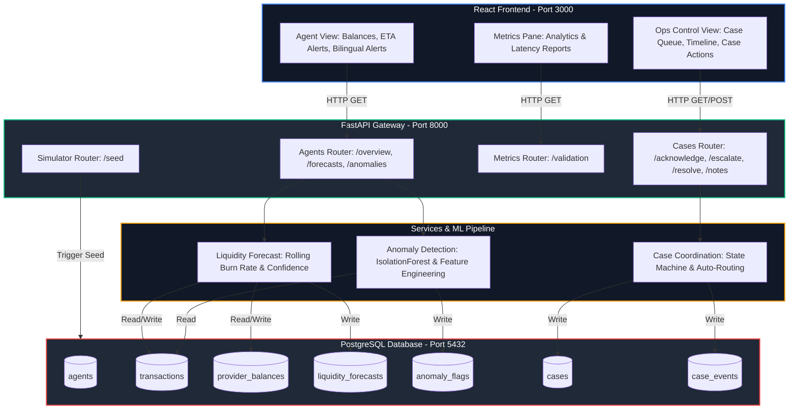

# Technical Architecture Diagram

This document details the software architecture, data flows, and analytical pipelines of the **Multi-Provider Super Agent** system.

---

## 1. System Flowchart

The following diagram illustrates how transaction events flow into the PostgreSQL database, trigger the liquidity forecasting and IsolationForest anomaly detectors, and populate the operations case coordination queue.

---

## 2. Core Components

1. **FastAPI Gateway**: Serves as a single entry point. Standardizes CORS headers for React integration and auto-creates schemas on startup.
2. **Liquidity Forecast Service**: 
   - Buckets transaction history into 15-minute intervals.
   - Calculates depletion rate per minute.
   - Adjusts confidence down when data feeds are delayed (Scenario C).
3. **IsolationForest Anomaly Detector**:
   - Performs transaction-level feature engineering (velocity, clustering, proximity to historical means).
   - Generates advisory flags with strict evidence context (never blocks transaction pipelines directly).
4. **Case Coordination engine**:
   - Manages state changes.
   - Employs routing rules to assign cases to their respective team roles.
   - Logs every timeline action to a read-only audit log table.
