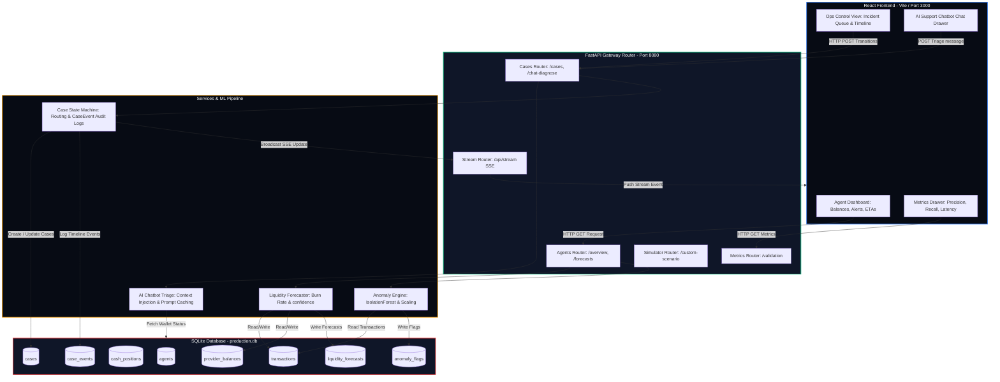

# Technical Architecture & Data Flow Guide
**Super-Agent Liquidity Intelligence Platform (SALI)**

This document details the software architecture, modular components, processing pipelines, and data flows of the SALI prototype. It is designed to give hackathon judges and engineering teams a clear, step-by-step understanding of how the system functions under the hood.

---

## 1. System Flowchart & High-Level Architecture

The diagram below illustrates the end-to-end data flow: transaction streams flow into the database, trigger liquidity forecasting and ML anomaly detection, generate case alerts, stream updates to the dashboard via Server-Sent Events (SSE), and interact with the AI Chatbot.



---

## 2. Layered Architecture Specifications

### 💻 A. Frontend Layer (React + Vite)
The user interface is a unified dashboard built using Vite and React, styled with Vanilla CSS using Glassmorphism principles.
*   **State Management & SSE Sync**: Opens a persistent `EventSource` connection to `GET /api/stream` on mount. When cases are updated, reassigned, or resolved, the server broadcasts an event that prompts the React client to refresh the dashboard instantly.
*   **Dynamic Theme & Legibility**: Standardizes custom properties in `index.css` for Dark and Light modes. Surplus tags ("Physical Cash Surplus", "Nagad Surplus", etc.) dynamically swap colors based on the theme to prevent poor contrast in Light Mode (AAA compliance).
*   **Toast System**: Triggers contextual popup alerts only when support cases are successfully generated.

### 🔌 B. API Gateway Layer (FastAPI)
The backend is an asynchronous Python 3.13 API gateway using FastAPI.
*   **CORS Configuration**: Standardized to enable communication with Vite development environments.
*   **Modular Routers**:
    -   `agents.py`: Serves unified wallet balances and forecast results.
    -   `cases.py`: Manages cases lifecycle and contains the chatbot endpoint `/chat-diagnose`.
    -   `simulate.py`: Receives custom parameters to seed sandbox scenarios.
    -   `metrics.py`: Computes precision, recall, and endpoint latencies.
    -   `stream.py`: Manages server-sent event (SSE) client pools.

### 🧠 C. Processing & System Intelligence Services
*   **1. Rolling Liquidity Forecaster (`services/liquidity.py`)**
    -   *Burn Rate*: Projects rolling transaction velocities in 15-minute intervals.
    -   *Data Quality Handler*: Evaluates feed timestamps. If a provider's balance feed is older than 1 hour, it reduces forecast confidence to a heavily penalized level (e.g. `15%`) and alerts the user of data delay.
*   **2. ML Anomaly Engine (`services/anomaly.py`)**
    -   *IsolationForest Model*: Trained on a Poisson-distributed 7-day normal baseline dataset. Evaluates transaction amounts, velocities, and counterparty repeat counts.
    -   *Advisory Output*: Anomalies are marked as "Requires Review" rather than auto-blocking wallets.
*   **3. Context-Aware Support Chatbot (`services/llm_advisor.py`)**
    -   *Triage Analyzer*: When an agent sends a message, the endpoint queries live context (agent area, cash positions, e-money balances, recent anomalies, recent forecasts) and feeds it to the LLM.
    -   *Conditional Ticket Triage*: Casual greetings or non-technical queries are handled immediately without opening tickets. Real technical/liquidity blockages automatically open a case in the DB, routed to the correct department (`field_officer`, `provider_ops`, `risk_analyst`).
    -   *Decision Guardrails*: Prompt parameters strictly forbid the model from making final business declarations (e.g. guaranteeing cash arrival times or altering user limits).
    -   *API Fallback Resilience*: Runs on Gemini, falling back to OpenAI on HTTP 429 rate limits, and finally drops back to local translation dictionaries.
*   **4. Case Coordination Engine (`services/coordination.py`)**
    -   Updates case statuses (open -> acknowledged -> escalated -> resolved).
    -   Appends timeline CaseEvent rows in the DB to construct a permanent, read-only audit log.

### 🗄️ D. Persistent Storage Layer (SQLite / PostgreSQL)
Uses SQLAlchemy ORM to manage SQL tables.
*   **Strict Wallet Siloing**: E-money balances are strictly partitioned by `provider_id`. The schema forbids cross-provider balance movements, adhering to financial regulatory silo boundaries.

---

## 3. End-to-End Incident Lifecycle Walkthrough

To understand how the layers interact, here is the step-by-step lifecycle of a transaction anomaly event:

```
[Agent A002] 5 duplicate BDT 9,999 cash-outs occur in 15 minutes.
     |
     v
[FastAPI Gateway] Receives transaction records and calls Anomaly Engine.
     |
     v
[Anomaly Engine] IsolationForest detects velocity spike. Computes anomaly score.
     |
     v
[Case Coordinator] Creates support ticket, assigns it to "risk_analyst" role.
     |
     v
[Database Engine] Saves new Case record and logs "created" CaseEvent in DB.
     |
     v
[SSE Broadcast] Server-Sent Events pushes "case_update" event to browser clients.
     |
     v
[React Frontend] Automatically refreshes Incident Control Room case queue.
     |
     v
[Risk Analyst User] Selects case, clicks "Acknowledge Case" (assigns owner).
     |
     v
[State Machine] Case updates to "acknowledged" state. CaseEvent timeline log written.
```
This traceable human-in-the-loop workflow guarantees auditability, data privacy, and strict regulatory safety at every step of MFS operations.
